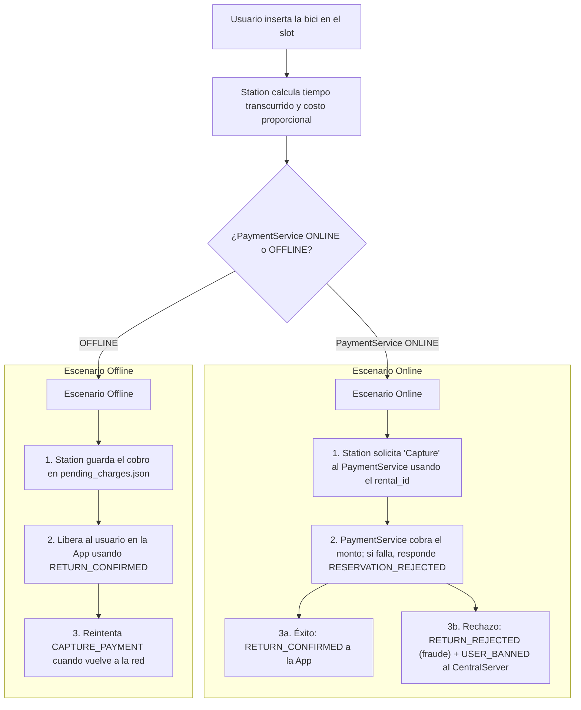
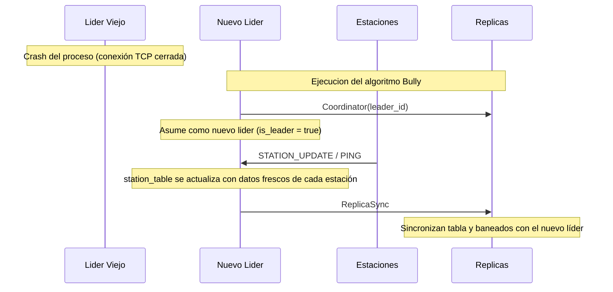

[](https://classroom.github.com/a/KujF6lFv)

# 🚲 BiciRed — Alquiler de Bicicletas

El sistema modela una red de estaciones de bicicletas distribuidas por la ciudad. Cada componente corre como un proceso independiente; y la comunicación entre procesos es a través de stream sockets (TCP), usando mensajes de texto delimitados por `|`.

Dentro de cada proceso se aplica el **modelo de actores** (mediante librería `actix`): cada subsistema es un thread independiente que sólo se comunica a través de mensajes tipados. Por lo que, no hay memoria compartida entre actores.

### Integrantes

| Nombre y Apellido | Padrón |
| :--- | :--- |
| Facundo Madotta | 112180 | 
| Fabricio Batastini | 111828 |
| Manuel Peñalva | 111696 |

---

## Tabla de contenidos

- [Arquitectura de procesos](#arquitectura-de-procesos)
- [Entidades principales](#entidades-principales)
  - [Station](#station)
  - [CentralServer](#centralserver)
  - [App](#app)
  - [PaymentService](#paymentservice)
- [Flujos principales](#flujos-principales)
- [Manejo de errores y caídas](#manejo-de-errores-y-caídas)
- [Operación offline](#operación-offline)
- [Algoritmos de concurrencia distribuida](#algoritmos-de-concurrencia-distribuida)
  - [Elección de líder — Bully](#elección-de-líder--bully)
  - [Transacciones de alquiler — 2PC](#transacciones-de-alquiler--2pc)
- [Guía de Ejecución y Comandos](#guía-de-ejecución-y-comandos)
- [Diagramas](#diagramas)

---

## Arquitectura de procesos

```
[APP] ──────────────────► [STATION]
[APP] ──────────────────► [CENTRALSERVER]
[STATION] ──────────────► [CENTRALSERVER]
[STATION] ──────────────► [PAYMENTSERVICE]
[CENTRALSERVER]─────────► [PAYMENTSERVICE]
```

| Proceso         | Rol                                                        |
|-----------------|------------------------------------------------------------|
| `Station`       | Gestiona slots físicos, coordina alquileres y devoluciones                        |
| `CentralServer` | Mantiene estado global de todas las estaciones             |
| `App`           | Simula la app móvil del usuario                            |
| `PaymentService`| Actúa como banco; preautoriza, captura y libera montos                        |

Se pueden correr múltiples instalaciones de `CentralServer` simultáneamente, definidas en un archivo `servers.csv`. Una actúa como **líder** (recibe actualizaciones de las Stations y replica el estado a los demás nodos). Las demás **réplicas** (responden consultas de disponibilidad de las Apps). Si el líder cae, los nodos restantes eligen a uno nuevo mediante el [Algoritmo de Bully](#elección-de-líder--bully).

---

## Entidades principales

### Station

Gestiona los slots físicos de una estación. Detecta bicicletas, las bloquea y desbloquea, coordina el cobro de tarifas con el `PaymentService` y reporta su estado al servidor central. **Opera de forma autónoma aunque pierda conectivdad**.

>**Invariante**: Cada `bike_id` pertenece a lo sumo a un alquiler activo a la vez. Una bicicleta solo puede ser alquilada si fue devuelta anteriormente (slot en estado `Occupied`, no `Empty` ni `Reserved`).

#### Estado interno

```rust
struct Station {
    id: StationId,
    location: Location,
    slots: Vec<Slot>,
    pending_rents: Vec<PendingRent>,
    pending_charges: Vec<PendingCharge>
}

struct Slot {
    index: usize,
    state: SlotState,
}

enum SlotState {
    Empty,
    Occupied { bike_id: BikeId },
    Reserved { rental_id: String },
}

struct PendingRentRecord {
    rental_id: String,
    card_token: String,
    bike_id: BikeId,
    user_id: UserId,
}

struct PendingChargeRecord {
    rental_id: String,
    amount_cents: u32,
    bike_id: BikeId,
}
```

### Identificación de alquileres - `rental_id`

Cada viaje se identifica con un `rental_id` único generado por la Station al inicial el alquiler:

```
rental_id = bike_id + user_id + timestamp_secs
```

Esta combinación garantiza unicidad sin depender de sincronización distribuida: una misma bicicleta no puede ser alquilada dos veces por el mismo usuario en el mismo instante. El `rental_id` viaja en todos los mensajes relacionados al viaje (`Prepare`, `VOTE_COMMIT`, `RentConfirmed`, `ReturnRequest`, etc) y es usado por el `PaymentService` para garantizar independencia: si se recibe dos veces la misma operación para el mismo `rental_id`, no la repite.

#### Arquitectura interna (threads)

| Thread            | Responsabilidad                                                                 |
|-------------------|---------------------------------------------------------------------------------|
| `Acceptor`        | Escucha nuevas conexiones TCP entrantes (de la App); spawnea un `ConnectionActor` por conexión   |
| `ConnectionActor`         | Traduce mensajes TCP (texto delimitado por `|`) a mensajes `actix` para el `StationActor`; uno por conexión          |
| `StationActor`   | Único dueño de `Vec<Slot>`; coordina el 2PC de alquiler y el flujo de devolución          |

#### Mensajes que recibe

| Mensaje         | Payload                                                  | Reacción                                                                                                      |
|-----------------|------------------------------------------------------------|------------------------------------------------------------------------------------------------------------|
| `RENT_REQUEST`  | `{ user_id, slot_index, card_token }`                       | Si el slot está `Occupied` → genera `rental_id`, lo marca `Reserved` e inicia 2PC con App y PaymentService; si no → `RENT_REJECTED` |
| `RETURN_REQUEST`| `{ user_id, bike_id, slot_index, started_at_secs, rental_id }` | Si el slot está `Empty` → calcula cargo proporcional al tiempo y solicita `CAPTURE_PAYMENT` al PaymentService; si no → `RETURN_REJECTED` |
| `VOTE_COMMIT`   | `{ transaction_id }`                                        | Voto de la App durante la fase de votación del 2PC                                                          |
| `VOTE_ABORT`    | `{ transaction_id }`                                        | Voto negativo de la App; dispara abort y rollback                                                            |
| `NOT_LEADER`    | `{ leader_addr }`                                           | Actualiza la dirección del líder conocida y reintenta el `STATION_UPDATE` pendiente     

#### Mensajes que envía

| Mensaje           | Destino              | Payload                                                                  |
|-------------------|----------------------|----------------------------------------------------------------------------|
| `PREPARE`         | App (TCP)            | `{ transaction_id }` — pide a la App confirmar que sigue activa y sin reserva |
| `RENT_CONFIRMED`  | App (TCP)            | `{ bike_id, pre_auth_cents, timestamp_secs, rental_id }`                  |
| `RENT_REJECTED`   | App (TCP)            | `{ reason }`                                                              |
| `RETURN_CONFIRMED`| App (TCP)            | `{ charged_cents, timestamp_secs }`                                       |
| `RETURN_REJECTED` | App (TCP)            | `{ reason }` — incluye el caso de fraude (ver `RETURN_REJECTED_FRAUD_REASON`) |
| `STATION_UPDATE`  | CentralServer (TCP)  | `StationStatus { station_id, location, available_bikes, free_slots, updated_at_secs, station_addr, slots_occupied, slots_frees }` |
| `PING`            | CentralServer (TCP)  | `{ station_id }` — heartbeat liviano para evitar que el líder elimine la estación por inactividad |
| `PREPARE_PAYMENT` | PaymentService (TCP) | `{ transaction_id, amount_cents, card_token }` — preautoriza el monto de seguridad |
| `COMMIT_PAYMENT`  | PaymentService (TCP) | `{ transaction_id }` — confirma la preautorización tras el commit del 2PC |
| `ROLLBACK_PAYMENT`| PaymentService (TCP) | `{ transaction_id }` — cancela la preautorización si el 2PC aborta        |
| `CAPTURE_PAYMENT` | PaymentService (TCP) | `{ transaction_id, amount_cents }` — cobra el monto final al devolver     |
| `USER_BANNED`     | CentralServer (TCP)  | `{ user_id, reason }` — informa al líder que un usuario debe ser baneado (cobro de devolución rechazado) |


#### Protocolo de transporte

TCP (stream sockets) con la App, con el CentralServer y PaymentService. Mensajes de texto delimitados por `|`, un mensaje por línea (terminados en `\n`)

#### Casos de interés

- **Feliz (alquiler):** ver [Flujo 1 - 2PC](#flujo-1--alquiler-caso-feliz)
- **Feliz (devolución online):** App envía `RETURN_REQUEST` → Station calcula cargo → envía `CAPTURE_PAYMENT` al PaymentService → responde `RETURN_CONFIRMED`.
- **Devolución offline:** Station guarda en `pending_charges_{id}.json`, libera al usuario respondiendo `RETURN_CONFIRMED`, reintenta el cobro al recuperar red.
- **App muere durante 2PC:** timeout en el socket → la estación aborta, envía `ROLLBACK_PAYMENT` al PaymentService, slot vuelve a `Occupied`.
- **Pago rechazado en Prepare:** PaymentService responde `VOTE_ABORT` → Station envía rollback implícito a la App (no se confirma el alquiler), slot vuelve a `Occupied`.
- **Cobro rechazado al devolver:** PaymentService responde `RESERVATION_REJECTED` → Station responde `RETURN_REJECTED { reason: RETURN_REJECTED_FRAUD_REASON }` y envía `USER_BANNED` al CentralServer líder. La bici queda devuelta físicamente (no penaliza al sistema), pero el usuario queda baneado.
- **Sin conectividad con CentralServer:** opera localmente, guarda en `pending_rents_{id}.json` / `pending_charges_{id}.json`, reintenta `STATION_UPDATE` periódicamente.

#### Manejo de devoluciones



Si previamente retiro una bicicleta en una estacion offline y al enviar Capture es rechazado el pago, entra en la lista negra del central server

---

### CentralServer

Mantiene una vista actualizada del estado de todas las estaciones, responde consultas de disponibilidad y administra la lista de usuarios baneados. Recibe actualizaciones periódicas de las estaciones sin bloquearlas.

Si dos nodos reciben un `STATION_UPDATE` con información contradictoria, gana la entrada más reciente (se reemplaza directamente porque solo el líder procesa escrituras).

```rust
struct CentralServerActor {
    server_id: ServerId,
    is_leader: bool,
    leader_id: Option<ServerId>,
    station_table: HashMap<StationId, StationStatus>,
    peers: HashMap<ServerId, Addr<ConnectionActor>>,
    elector_addr: Option<Addr<ElectorActor>>,
    peer_addrs: HashMap<ServerId, String>,
    users_banned: HashMap<UserId, String>,
}

struct StationStatus {
    station_id: StationId,
    location: Location,
    available_bikes: u8,
    free_slots: u8,
    updated_at_secs: u64,
    station_addr: String,
    slots_occupied: String,
    slots_frees: String,
}
```

#### Arquitectura interna (threads)
 
| Actor              | Responsabilidad                                                                                              |
|--------------------|------------------------------------------------------------------------------------------------------------|
| `Acceptor`         | Escucha el puerto TCP propio; spawnea un `ConnectionActor` (entrante) por cada conexión nueva (Station, App o peer) |
| `SpawnerActor`     | Recibe las conexiones entrantes del `Acceptor` y crea el `ConnectionActor` correspondiente                  |
| `ConnectionActor`  | Uno por conexión TCP (entrante o saliente); parsea mensajes y los traduce a mensajes `actix` para `CentralServerActor` y `ElectorActor` |
| `CentralServerActor` | Único dueño de `station_table` y `users_banned`; responde `NEARBY_QUERY`, aplica `STATION_UPDATE`, ejecuta garbage collection de estaciones inactivas |
| `ElectorActor`     | Implementa el Algoritmo de Bully: detecta caída del líder, gestiona elecciones y anuncia coordinador        |

#### Mensajes que recibe

| Mensaje          | Payload                                                  | Reacción                                                                                       |
|------------------|--------------------------------------------------------|--------------------------------------------------------------------------------------------------|
| `STATION_UPDATE` | `StationStatus` serializado                              | Si es líder: actualiza `station_table` y dispara `REPLICA_SYNC`; si es réplica: responde `NOT_LEADER` |
| `NEARBY_QUERY`   | `{ user_id, x, y, radius }`                              | Si es líder: responde `NOT_REPLICA` (delega la carga); si es réplica: filtra por distancia euclídea y responde `NEARBY_RESPONSE`, o `BAN_NOTIFICATION` si el usuario está baneado |
| `VALIDATE_USER`  | `{ user_id }`                                            | Responde `USER_VALIDATION_RESULT` indicando si el usuario está en `users_banned`               |
| `USER_BANNED`    | `{ user_id, reason }`                                    | Agrega el usuario a `users_banned`, persiste en disco y dispara `REPLICA_SYNC`                |
| `REPLICA_SYNC`   | `{ station_table, banned_users }`                        | Si no es líder: reemplaza `station_table` y `users_banned` locales con los recibidos           |
| `PING`           | `{ station_id }`                                         | Actualiza `updated_at_secs` de esa estación (heartbeat liviano, evita el GC)                    |
| `HELLO`          | `{ server_id }`                                          | Registra la conexión entrante de un peer en `peers` y en el `ElectorActor`                      |
| `ELECTION`       | `{ candidate_id }`                                       | El `ElectorActor` participa del Algoritmo de Bully                                              |
| `ELECTION_ACK` / `ACK` | `{}`                                                | El `ElectorActor` marca que un nodo de mayor ID está vivo y se retira de la elección actual     |
| `COORDINATOR`    | `{ leader_id }`                                          | El `ElectorActor` actualiza `leader_id`, ajusta `is_leader` y propaga `ROLE_UPDATE` al `CentralServerActor` |

#### Mensajes que envía

| Mensaje           | Destino                  | Payload                                                              |
|-------------------|--------------------------|------------------------------------------------------------------------|
| `NEARBY_RESPONSE` | App                      | `Vec<StationStatus>` (estaciones dentro del radio)                    |
| `BAN_NOTIFICATION`| App                      | `{ reason }`                                                          |
| `USER_VALIDATION_RESULT` | Station / App      | `{ user_id, is_valid, reason }`                                       |
| `NOT_LEADER`      | Station                  | `{ leader_addr }` — redirige el `STATION_UPDATE` al líder actual      |
| `NOT_REPLICA`     | App                      | `{ replica_addr }` — redirige el `NEARBY_QUERY` a una réplica         |
| `REPLICA_SYNC`    | Otros CentralServer (réplicas) | `{ station_table, banned_users }`                                |
| `HELLO`           | Otros CentralServer (peers) | `{ server_id }` — handshake al establecer conexión saliente        |
| `ELECTION`        | Peers con ID mayor       | `{ candidate_id }`                                                    |
| `ELECTION_ACK`    | Peer que inició la elección | `{}` — "yo tengo ID mayor, abortá tu elección"                     |
| `COORDINATOR`     | Todos los peers          | `{ leader_id }`                                                       |

### Limpieza de estaciones

El líder ejecuta cada 15 segundos una limpieza: si una estación no actualizó `updated_at_secs` (vía `STATION_UPDATE` o `PING`) en más de 30 segundos, se elimina de `station_table` y se propaga el cambio vía `REPLICA_SYNC`. Esto minimiza el envío de heartbeats explícitos: el propio `PING` liviano de la Station alcanza para mantenerla viva en la tabla. Si nunca llego, la estación se da como "muerta".

#### Protocolo de transporte

TCP (stream sockets) para toda comunicación.

#### Casos de interés

 
- **Feliz:** Station envía `STATION_UPDATE` al líder → líder actualiza `station_table` y dispara `REPLICA_SYNC` a las réplicas → App consulta una réplica → `NEARBY_RESPONSE`.
- **Station conecta al nodo equivocado:** si no es líder, responde `NOT_LEADER` con la dirección del líder conocida.
- **App conecta al líder:** el líder responde `NOT_REPLICA` con la dirección de una réplica, para no sobrecargar al nodo de escritura con consultas de lectura.
- **Usuario baneado:** `NEARBY_QUERY` de un usuario baneado recibe `BAN_NOTIFICATION` en lugar de `NEARBY_RESPONSE`.
- **Líder cae:** ver [Elección de líder — Bully](#elección-de-líder--bully).

---

### App

Simula la app móvil del usuario. Se conecta directamente a la estación para alquilar/devolver y al servidor central para consultar disponibilidad. Mantiene caché local para operación offline y persiste su alquiler activado en disco.

```rust
struct AppClient {
    user_id: UserId,
    current_rental: Option<ActiveRental>,
    cached_stations: Vec<StationStatus>,
    is_blocked: bool,
    central_servers: Vec<String>,
    active_server_addr: String,
    actual_rental_id: Option<String>,
}

struct ActiveRental {
    bike_id: BikeId,
    started_at_secs: u64,
    pre_auth_cents: u32,
    station_id: StationId,
}
```

`current_rental` se persiste en `rental_state_<user_id>.json` y se restaura al iniciar la App, de forma que un alquiler activo sobrevive a un reinicio del proceso.

#### Mensajes que recibe

| Mensaje           | Origen        | Payload                                                              |
|-------------------|---------------|------------------------------------------------------------------------|
| `RENT_CONFIRMED`  | Station       | `{ bike_id, pre_auth_cents, timestamp_secs, rental_id }`               |
| `RENT_REJECTED`   | Station       | `{ reason }`                                                            |
| `RETURN_CONFIRMED`| Station       | `{ charged_cents, timestamp_secs }`                                     |
| `RETURN_REJECTED` | Station       | `{ reason }` — distingue el caso de fraude (`RETURN_REJECTED_FRAUD_REASON`) |
| `NEARBY_RESPONSE` | CentralServer | `Vec<StationStatus>`                                                    |
| `PREPARE`         | Station       | `{ transaction_id }` — la Station pide confirmar que la App sigue activa y sin reserva |
| `NOT_REPLICA`     | CentralServer | `{ replica_addr }` — redirige a la réplica correcta                     |
| `BAN_NOTIFICATION`| CentralServer | `{ reason }` — informa que el usuario fue baneado                       |

#### Mensajes que envía

| Mensaje          | Destino       | Payload                                                          |
|------------------|---------------|---------------------------------------------------------------------|
| `NEARBY_QUERY`   | CentralServer | `{ user_id, x, y, radius }`                                       |
| `RENT_REQUEST`   | Station       | `{ user_id, slot_index, card_token }`                             |
| `RETURN_REQUEST` | Station       | `{ user_id, bike_id, slot_index, started_at_secs, rental_id }`    |
| `VOTE_COMMIT`    | Station       | `{ transaction_id }` — App activa y sin reserva activa             |

#### Protocolo de transporte

TCP (stream sockets). No escucha ningún puerto, solo incia conexiones. Implementa rotación de servidores: si falla al conectar con `active_server_addr`, rota al siguiente nodo de `central_servers` (hasta `MAX_RETRIES = 5`); sino lo da como servidor OFFLINE.

#### Casos de interés

- **Sin señal consultando disponibilidad:** si tras `MAX_RETRIES` no logra contactar a ningún `CentralServer`, muestra `cached_stations` (última `NEARBY_RESPONSE` recibida).
- **Sin señal alquilando o devolviendo:** la App ya tiene la dirección de la Station en `cached_stations` (campo `station_addr`); conecta directamente sin pasar por el CentralServer.
- **Conexión al nodo líder:** recibe `NOT_REPLICA`, actualiza `active_server_addr` a la réplica indicada y reintenta.
- **Usuario bloqueado:** recibe `BAN_NOTIFICATION`, marca `is_blocked = true` y no permite nuevos alquileres.
- **Reinicio con alquiler activo:** al arrancar, lee `rental_state_<user_id>.json` y restaura `current_rental`.

---

### PaymentService

El proceso PaymentService que funcionara como un banco mediante conexiones TCP ya sea con el server o con las estaciones
- Preautoriza montos (asocia tarjeta, monto preautorizado y rental_id)
- Cobra/Libera: Dependiendo del monto final cobra extra o libera el monto previo sobrante
- Usa el rental_id para evitar cobros extra. Si ya esta en su memoria no cobra de vuelta

```rust
struct PaymentServiceActor {
    transactions: HashMap<String, Transaction>,
    cards: HashMap<String, u32>,
    csv_path: String,
}

enum TransactionStatus {
    PreAuthorized,
    Committed,
    Captured,
    RolledBack,
}

struct Transaction {
    card_token: String,
    amount_cents: u32,
    status: TransactionStatus,
    timestamp: Instant,
}

```

### Aquitectura interna (actores)

| Actor                 | Responsabilidad                                                                  |
|-----------------------|------------------------------------------------------------------------------------|
| `Acceptor`            | Escucha conexiones TCP entrantes (de las Stations)                                 |
| `SpawnerActor`        | Crea un `ConnectionActor` por cada conexión nueva                                  |
| `ConnectionActor`     | Traduce mensajes TCP a mensajes `actix` para el `PaymentServiceActor`             |
| `PaymentServiceActor` | Único dueño de `transactions` y `cards`; ejecuta limpieza periódica de transacciones atascadas |

#### Mensajes que recibe

| Mensaje            | Payload                                          | Reacción                                                                                                  |
|--------------------|----------------------------------------------------|---------------------------------------------------------------------------------------------------------|
| `PREPARE_PAYMENT`  | `{ transaction_id, amount_cents, card_token }`     | Si la transacción ya existe, responde según su estado actual (idempotencia). Si no, intenta debitar el monto: si hay fondos, registra `PreAuthorized` y responde `VOTE_COMMIT`; si no, responde `VOTE_ABORT` |
| `COMMIT_PAYMENT`   | `{ transaction_id }`                               | Si la transacción estaba `PreAuthorized`, pasa a `Committed`                                              |
| `ROLLBACK_PAYMENT` | `{ transaction_id }`                               | Si estaba `PreAuthorized`, reintegra el monto a la tarjeta y pasa a `RolledBack`                          |
| `CAPTURE_PAYMENT`  | `{ transaction_id, amount_cents }`                 | Si estaba `Committed` y hay fondos suficientes para el monto final, debita y pasa a `Captured`, responde `PAYMENT_RESULT { success: true }`; si no, responde `RESERVATION_REJECTED` |
| `RESERVE_PAYMENT`  | `{ transaction_id, amount_cents, card_token }`     | Variante usada para reservas directas (modo offline): registra `Committed` y debita; si falla, responde `RESERVATION_REJECTED` |

#### Mensajes que envía

| Mensaje                | Destino | Payload                                                       |
|------------------------|---------|----------------------------------------------------------------|
| `VOTE_COMMIT`           | Station | `{ transaction_id }`                                           |
| `VOTE_ABORT`            | Station | `{ transaction_id }`                                           |
| `PAYMENT_RESULT`        | Station | `{ transaction_id, success, amount_cents }`                    |
| `RESERVATION_REJECTED`  | Station | `{ transaction_id, reason }`                                   |

### Limpieza de transacciones atascadas

Cada 10 segundos, `PaymentServiceActor` recorre `transactions` y revierte (`RolledBack`, reintegrando fondos) cualquier transacción que siga en `PreAuthorized` por más de 30 segundos. Esto evita que fondos preautorizados queden bloqueados indefinidamente si una Station cae a mitad del 2PC.

### Persistencia

- `cards`: persistido en el CSV idicando por argumento (`token,saldo`)
- `transactions`: persistidas a disco y recargadas al iniciar (`load_transactions` / `save_transaction`)

#### Protocolo de transporte

TCP (stream sockets) para toda comunicación con las `Stations` y otros procesos del sistema.

#### Casos de interés

- **Preautorización exitosa:** recibe `PreparePayment` -> reserva temporalmente los fondos -> registra la transacción -> responde `VoteCommit`.
- **Fondos insuficientes:** recibe `PreparePayment` -> detecta saldo insuficiente -> responde `VoteAbort`.
- **Commit del alquiler:** recibe `CommitPayment` -> actualiza el estado a `Commited`.
- **Abort de la transacción:** recibe `RollbackPayment` -> reintegra los fondos reservados -> actualiza el estado a `RolledBack`.
- **Captura definitiva del pago:** recibe `CapturePayment` -> actualiza el estado a `Captured`.
- **Reintentos de mensajes:** si recibe nuevamente un `PreparePayment` para una transacción ya registrada en estado `PreAuthorized` o `Commited`, responde nuevamente `VoteCommit`, evitando inconsistencias por retransmisiones.
- **Prevención de cobros duplicados:** el uso de `transaction_id` permite identificar operaciones ya procesadas e impedir que una misma transacción sea ejecutada múltiples veces.

#### Estados de una transacción

```text
PreparePayment
        │
        ▼
PreAuthorized
    ├── CommitPayment ─────► Commited ─── CapturePayment ───► Captured
    │
    └── RollbackPayment ─────────────────────────────────────► RolledBack
```

---

## Flujos principales

### Flujo 1 — Alquiler (caso feliz)

```
App  ──RENT_REQUEST───────────────────────────────►  Station
                                                     Station genera rental_id
                                                     marca slot Reserved
                              Station  ──PREPARE_PAYMENT──►  PaymentService
                              Station  ◄─VOTE_COMMIT───────  PaymentService
Station  ──PREPARE(transaction_id)──────────────────►  App
App  ──VOTE_COMMIT(transaction_id)───────────────────►  Station
                              Station  ──COMMIT_PAYMENT──►  PaymentService
App  ◄──RENT_CONFIRMED(rental_id, bike_id, pre_auth)──  Station
                         Station  ──STATION_UPDATE──►  CentralServer líder
                                    líder  ──REPLICA_SYNC──►  Réplicas
```

### Flujo 2 — Devolución (caso feliz)

```
App  ──RETURN_REQUEST(rental_id)────────────────────►  Station
                                                       Station calcula cargo
                              Station  ──CAPTURE_PAYMENT(rental_id, charged_cents)──►  PaymentService
                              Station  ◄─PAYMENT_RESULT(success=true)──────────────  PaymentService
App  ◄──RETURN_CONFIRMED──────────────────────────────  Station
                         Station  ──STATION_UPDATE──►  CentralServer líder
                                    líder  ──REPLICA_SYNC──►  Réplicas
```

### Flujo 2b — Devolución con cobro rechazado (fraude)
 
```
App  ──RETURN_REQUEST(rental_id)────────────────────►  Station
                              Station  ──CAPTURE_PAYMENT──►  PaymentService
                              Station  ◄─RESERVATION_REJECTED──  PaymentService
App  ◄──RETURN_REJECTED(reason=FRAUD)─────────────────  Station
                         Station  ──USER_BANNED(user_id, reason)──►  CentralServer líder
                                    líder  ──REPLICA_SYNC──►  Réplicas (banned_users actualizado)
```

### Flujo 3 — Consulta de estaciones cercanas

```
App  ──NEARBY_QUERY(user_id, x, y, radius)──────────►  CentralServer (cualquiera)
       si es líder:
App  ◄──NOT_REPLICA(replica_addr)────────────────────  CentralServer líder
App  ──NEARBY_QUERY──────────────────────────────────►  CentralServer réplica
App  ◄──NEARBY_RESPONSE(stations)────────────────────  CentralServer réplica
       (o BAN_NOTIFICATION si el usuario está baneado)
```

### Flujo 4 — Caída del líder y reconexión
 
```
réplica_2 detecta PeerDisconnected del líder (conexión TCP cerrada)

réplica_2  ──Election(id=2)──►  réplica_3
réplica_2  ──Election(id=2)──►  réplica_4

réplica_3  ──ELECTION_ACK────►  réplica_2
réplica_4  ──ELECTION_ACK────►  réplica_2
   (réplica_2 espera COORDINATOR_TIMEOUT; al no recibirlo, reinicia su elección)
 
réplica_3, réplica_4 inician sus propias elecciones al recibir ELECTION
réplica_4  ──ELECTION(id=4)──►  (nadie con ID mayor responde)
réplica_4 se proclama líder
réplica_4  ──COORDINATOR(id=4)──►  réplica_2, réplica_3
 
réplica_2, réplica_3 actualizan leader_id=4, is_leader=false
réplica_4 actualiza is_leader=true y dispara REPLICA_SYNC a todos los peers

Station intenta reportar estado usando la última IP conocida:
Station  ──StationUpdate──►  réplica_2  (ex líder u otro peer al azar)
Station  ◄──NotLeader(leader_addr=réplica_4)──  réplica_2
Station  ──StationUpdate──►  réplica_4  (actualización exitosa)
 
App intenta buscar bicicletas en un nodo que resultó ser el nuevo líder:
App  ──NearbyQuery──►  réplica_4
App  ◄──NotReplica(replica_addr=réplica_2)──  réplica_4
App  ──NearbyQuery──►  réplica_2  (consulta exitosa)
```
 
---

## Manejo de errores y caídas

| Escenario                  | Comportamiento                                                                                       |
|----------------------------|------------------------------------------------------------------------------------------------------|
| **Crash de la App durante 2PC**    | Station detecta timeout esperando `VOTE_COMMIT`; aborta, envía `ROLLBACK_PAYMENT` al PaymentService, slot vuelve a `Occupied` |
| **Fallo en pago**          | La transacción se marca como `pending` para ser reintentada más adelante                             |
| **Muerte de Proceso Station** | La información actual se guardará en disco en un archivo json para mantener el último estado antes de la caída, para una posterior recuperación |
| **Pago rechazado en Prepare**      | PaymentService responde `VOTE_ABORT`; Station no confirma el alquiler, responde `RENT_REJECTED`, slot vuelve a `Occupied` |
| **Cobro rechazado al devolver**    | PaymentService responde `RESERVATION_REJECTED`; Station responde `RETURN_REJECTED` (fraude) y envía `USER_BANNED` al líder |
| **Caída del CentralServer (TODOS)**| Las estaciones siguen funcionando. Los usuarios no pueden buscar nuevas estaciones pero pueden interactuar con las que ya conocen; al reconectarse lee archivo json de los baneados. |
| **Caída del CentralServer líder**  | `ElectorActor` de las réplicas detecta `PeerDisconnected`; eligen nuevo líder por Bully; nuevo líder dispara `REPLICA_SYNC` |
| **Caída de Station**               | `pending_rents.json` y `pending_charges.json` preservan el estado offline; al reiniciar, retoma el envío pendiente       |
| **Caída de la App**                | `rental_state_<user_id>.json` preserva `current_rental`; al reiniciar, la App restaura su alquiler activo                |
| **Transacción de pago atascada**   | `PaymentServiceActor` revierte automáticamente (`RolledBack`) transacciones `PreAuthorized` con más de 30 segundos       |
| **Estación inactiva/caducada**              | El líder elimina de `station_table`; estaciones sin `STATION_UPDATE`/`PING` por más de 30 segundos, y propaga vía `REPLICA_SYNC` |
 
---

## Operación offline

### App sin señal — consulta de disponibilidad

Tras `MAX_RETRIES` fallidos rotando entre los `CentralServer` conocidos, usa `cached_stations` (última `NearbyResponse` recibida).

### Pérdida de conexión con CentralServer (App o Station)

- **Alquiler**: se permite si la App ya tiene la IP de la estación en caché. La estación guarda el evento localmente y actualiza su estado.
- **Sincronización**: cuando la conexión se recupera, la estación envía un `BatchUpdate` al servidor para regularizar los estados.

### Station sin conexión con CentralServer o PaymentService
 
**Alquiler offline (modo optimista):**
- La Station genera el `rental_id` e intenta contactar al `PaymentService`. Si no responde, asume el riesgo y degrada el 2PC (no espera el voto del banco en tiempo real).
- Guarda inmediatamente y de forma síncrona en `pending_rents.json`: `{ rental_id, user_id, card_token, bike_id, timestamp }`.
- Responde `RENT_CONFIRMED` a la App con el `rental_id` generado.

**Devolución offline:**
- La Station calcula el cargo y lo guarda en `pending_charges.json`: `{ rental_id, bike_id, charged_cents }`.
- Libera al usuario respondiendo `RETURN_CONFIRMED`.

**Sincronización al recuperar red:**
- Lee `pending_rents.json` y envía `PREPARE_PAYMENT`/`RESERVE_PAYMENT` en lote al `PaymentService`.
- Lee `pending_charges.json` y envía `CAPTURE_PAYMENT` en lote.
- Envía `STATION_UPDATE` consolidado al `CentralServer` líder para informar qué bicicletas se retiraron/devolvieron mientras estuvo desconectada.
- Si algún `CAPTURE_PAYMENT` pendiente es rechazado, se notifica `USER_BANNED` al líder.

---

## Algoritmos de concurrencia distribuida

### Elección de líder — Bully

Para evitar que `CentralServer` sea un único punto de falla, se mantiene una cantidad de réplicas constantes del servidor ejecutándose de forma independiente.

**Topología de conexiones:** cada nodo abre conexión saliente hacia los peers con `id` mayor al propio (y dirección distinta a la propia); los nodos con `id` menor reciben esas conexiones como entrantes.

**Detección de caída:** Cuando la conexión TCP con un peer se cierra, `ConnectionActor` notifica `PeerDisconnected` al `ElectorActor`. Si el peer caído era el líder (`leader_id`), se limpia el estado local y se inicia una nueva elección.

**Algoritmo**:
1. El nodo que detecta la caída envía `Election` a todos los nodos con ID mayor.
2. Si nadie responde -> se proclama líder, anuncia `Coordinator` con su dirección a todos.
3. Si alguien responde `ELECTION_ACK` -> ese nodo toma el control y repite el proceso hacia arriba.
4. El nodo con el ID más alto que esté activo siempre gana.

**Reconexión:** al recibir `Coordinator`, cada réplica actualiza su `leader_addr`. Por el lado de los clientes (Station o App), mantienen localmente una lista de direcciones IP de los nodos del servidor. Si fallan al conectarse con un nodo, intentan con el siguiente de su lista. Si logran conectarse pero el nodo no tiene el rol adecuado para procesar el mensaje, el servidor responderá con `NotLeader` o `NotReplica`, indicándole al cliente la dirección IP correcta a la cual debe reconectarse.


### Persistencia y Recuperación del Estado ante Caída del Líder

Durante la operación normal, el `CentralServer` líder replica de manera asíncrona la tabla global de estados (`station_table`) hacia las réplicas mediante el mensaje `ReplicaSync`. No obstante, si el líder sufre un crash inesperado, existe una pequeña ventana de tiempo en la cual los cambios de estado o transacciones recientes de las estaciones podrían no haber sido replicados, generando una pérdida potencial de información en los nodos restantes.

Para solucionar esta inconsistencia tras la ejecución del algoritmo de Bully y la proclamación de un nuevo líder mediante el mensaje `Coordinator`, se implementa un **Protocolo de Reconciliación Activa**. El nuevo líder no asume que su copia local de la base de datos refleja la realidad de la ciudad; en su lugar, reconstruye el estado del sistema consultando directamente a las fuentes de la verdad: las estaciones distribuidas.

#### Protocolo de Reconciliación Paso a Paso:

1. **Detección y Elección:** Al caer el líder viejo, los sockets TCP de las réplicas se cierran abruptamente. Los nodos detectan la caída y ejecutan la elección por Bully. El nodo ganador se proclama enviando el mensaje `Coordinator(id)` a sus peers.
2. **Asunción Inmediata:** El nuevo líder actualiza su estado interno (`is_leader = true`). Dado que ya posee la última versión de la `station_table` gracias a las replicaciones pasadas, comienza a aceptar operaciones de escritura instantáneamente. No necesita interrogar al resto de la red.
3. **Redirección de Estaciones (Lazy Routing):** Las estaciones físicas son ajenas a las elecciones del servidor. Cuando una estación intenta enviar su `StationUpdate` periódico, el socket falla (por el crash previo) y la estación itera sobre su lista local de IPs buscando un nodo activo.
   * Si se conecta de casualidad a un nodo que actualmente es réplica, este rechaza el mensaje y responde con `NotLeader(ip_nuevo_lider)`, informándole a dónde debe dirigirse.
4. **Convergencia:** La estación actualiza su enrutamiento interno y envía el `StationUpdate` a la IP correcta. El nuevo líder procesa la actualización y emite un nuevo `ReplicaSync` al resto del clúster (Broadcast), manteniendo la consistencia.


**Roles:**

```
Station_1  ──StationUpdate──►  CentralServer_líder
Station_2  ──StationUpdate──►  CentralServer_líder
                               CentralServer_líder  ──ReplicaSync──►  CentralServer_2
                               CentralServer_líder  ──ReplicaSync──►  CentralServer_3

App_1  ──NearbyQuery──►  CentralServer_2  (réplica)
App_2  ──NearbyQuery──►  CentralServer_3  (réplica)
```
Ver detalle en [Diagrama UML](#diagrama-de-elección-de-líder-bully)

---

### Transacciones de alquiler — 2PC

Para garantizar el correcto flujo en el alquiler de las bicicletas, previniendo inconsistencias como el doble alquiler de una bicicleta, alquileres sin fondos autorizados, o múltiples retiros simultáneos por parte del mismo cliente, se recurre a un protocolo de compromiso en dos fases (2PC).

**Identificador Único Global (`rental_id`)**: Al iniciarse la transacción, la estación genera un identificador único definido bajo la regla: `String rental_id = bike_id + user_id + timestamp`. Al componerse de estas variables concurrentes, posee unicidad global absoluta y elimina la dependencia de un servidor centralizado de sincronización.

| Rol           | Participante               |
|---------------|----------------------------|
| Coordinador   | `Station Actor`  |
| Participante 1| App del usuario  |
| Participante 2| Proceso `PaymentService` |

**Fase 1 — Prepare:**
La estación muta el estado del slot físico a `ReservedForRent` y genera el `rental_id`. Acto seguido, envía de forma paralela un mensaje de `Prepare` a:
- La **App**: Valida que la terminal del usuario continúe en línea y no retenga ninguna otra transacción o reserva activa en memoria.
- El **PaymentService**: Comprueba los fondos de la tarjeta del cliente y efectúa de manera formal la preautorización del monto de seguridad asociado al `rental_id`.

**Fase 2 — Fase de Voto y Commit / Abort:**
- **Voto Positivo**: Si la App y el `PaymentService` retornan en sus respuestas el flag `Vote_Commit` (lo que certifica retención exitosa de fondos y usuario habilitado), la transacción avanza.
- **Voto Negativo o Timeout**: Si cualquiera de las partes emite un `Vote_Abort` o el socket de comunicación experimenta un timeout (ej. desconexión abrupta de la App), la estación aborta. Revierte de forma inmediata el slot a `Occupied` y envía las alertas de rollback pertinentes: si el problema provino de la App, se le ordena al `PaymentService` desreservar el monto; si el fallo fue del banco, se le instruye rollback a la App para limpiar su memoria.
- **Commit Definitivo**: Tras el consenso exitoso, la estación despacha el mensaje definitivo de `Commit` a ambos procesos. Se destraba físicamente el slot de la bicicleta, la App asienta el registro en `ActiveRental`, y la estación notifica en paralelo al `CentralServer` líder que la bicicleta ha sido retirada.

---
**Caso offline**

Station (Coordinador) genera el rental_id e intenta abrir un socket TCP con el PaymentService para solicitar la preautorización. Al no obtener respuesta, la estación detecta que está offline.
Modo Optimista: la estación no aborta la transacción. Decide asumir el riesgo y degrada el 2PC, eliminando temporalmente al PaymentService de la votación en tiempo real.
Guarda de forma inmediata y síncrona los datos del alquiler (rental_id, user_id, card_token, bike_id y timestamp) en un archivo local llamado pending_rents.json
Responde RentConfirmed a la App enviándole el rental_id generado

BatchUpdate: En cuanto detecta que la conexión TCP con el exterior se ha restablecido, lee el archivo pending_rents.json y envía en lote todas las preautorizaciones pendientes al PaymentService
Envía un StationStatus consolidado al CentralServer líder para informarle qué bicicletas se retiraron mientras estuvo desconectada

---

**Post-commit:**
- Si está **online**: envía `StationStatus` inmediatamente al líder del `CentralServer`.
- Si está **offline**: retiene el evento y lo incluye en el `BatchUpdate` al recuperar conectividad.

---

## Guía de Ejecución y Comandos

### Requisitos Previos
Tener instalado el *toolchain* oficial de Rust (`cargo` y `rustc` en versión estable).

### 1. Compilación del Proyecto
Para compilar todos los binarios que componen el ecosistema BiciRed de forma centralizada, desde la raíz del repositorio ejecutar:
```bash
cargo build --release
```

### 2. Ejecución del Servidor Central (Clúster de Servidores)
El ejecutable requiere pasarle por argumento el ID único de nodo, la dirección IP/puerto local donde escuchará, y el archivo de ruteo CSV que define los miembros de la red:
```bash
# Firma: cargo run --bin central_server <server_id> <ip_servidor> <servers.csv>
# Ejemplo para levantar un clúster local de 3 nodos independientes:
cargo run --bin central_server 1 127.0.0.1:8000 servers.csv
cargo run --bin central_server 2 127.0.0.1:8001 servers.csv
cargo run --bin central_server 3 127.0.0.1:8002 servers.csv
```

### 3. Ejecución del banco (Payment Service)
Para iniciar el servicio de cobros simulado; se requiere pasarle la dirección IP/puerto local donde escuchará, y el archivo de ruteo CSV donde se definen las tarjetas (Token y saldo)
```bash
# Firma: cargo run --bin payment_service <ip_banco> tarjetas.csv
# Ejemplo:
cargo run --bin payment_service 127.0.0.1:8080 tarjetas.csv
```

### 4. Ejecución de las estaciones
Para iniciar el servicio de estaciones; se requiere pasarle por argumento el ID único de la estación, los archivos CSV donde se definen los servidores y estaciones (para obteners coordenas, slots, etc) y la dirección IP/puerto local donde escucha el banco.
```bash
# Firma: cargo run --bin station <id> servers.csv stations.csv <ip_banco>
# Ejemplo:
cargo run --bin station 1 servers.csv stations.csv 127.0.0.1:8080
```

### 5. Ejecución de la App
Para iniciar la aplicación del cliente, se requiere pasarle por argumento el ID único del cliente (como si fuese el nomnbre de usuario), y el archivo CSV donde se definen los servidores.

```bash
# Firma: cargo run --bin app <id> servers.csv
# Ejemplo:
cargo run --bin app 1 servers.csv
```

### 6. Ejecución de Tests
Para ejecutar los tests armados.

```bash
cargo test
```

---

## Diagramas

### Diagrama de clases


### Diagrama de threads


### Diagrama de flujo alquiler


### Diagrama de elección de líder (Bully)


### Diagrama de Recuperacion de Informacion Post Bully



