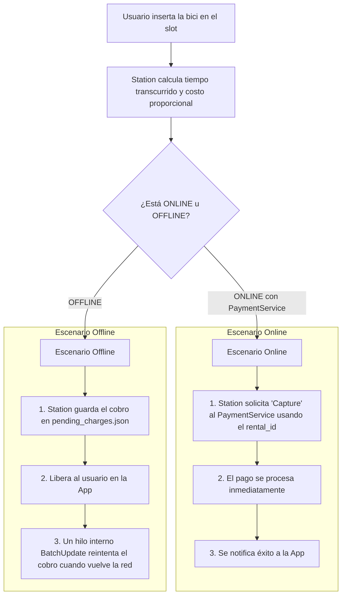
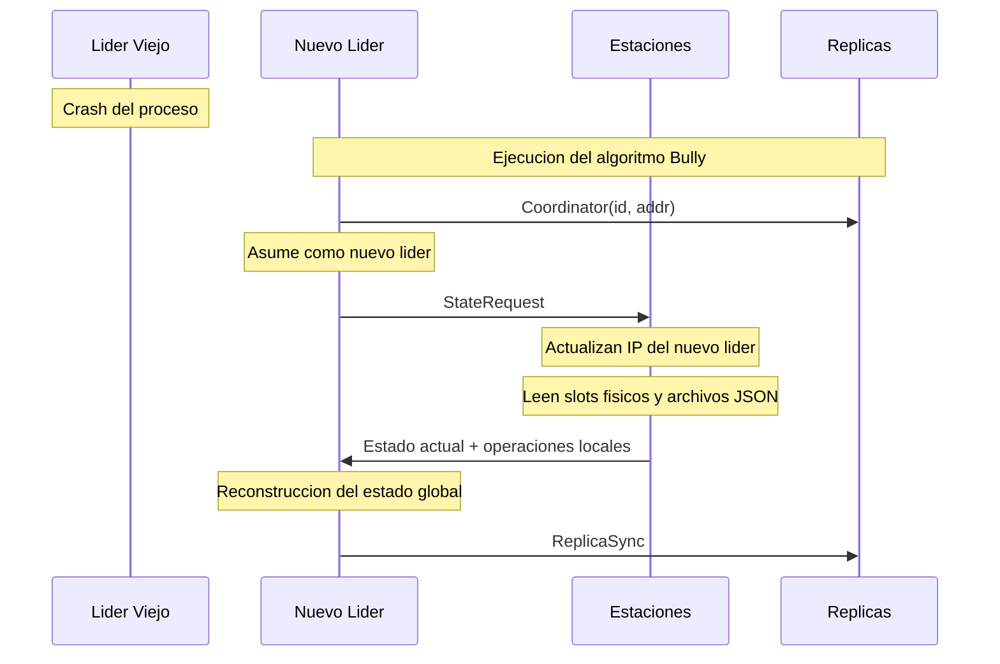

[](https://classroom.github.com/a/KujF6lFv)

# 🚲 BiciRed — Alquiler de Bicicletas

El sistema modela una red de estaciones de bicicletas distribuidas por la ciudad. Cada componente corre como un proceso independiente; y la comunicación entre procesos es a través de sockets.

Dentro de cada proceso se aplica el modelo de actores: cada subsistema es un thread independiente que sólo se comunica a través de canales (usando la librería de Rust mpsc) tipados. Por lo que, no hay memoria compartida entre actores.

### Integrantes

| Nombre y Apellido | Padrón |
| :--- | :--- |
| Facundo Madotta | 112180 | 
| Fabricio Batastini | 111828 |
| Manuel Peñalva | 111696 |

---

## Tabla de contenidos

- [Arquitectura de procesos](#arquitectura-de-procesos)
- [Entidades principales](#entidades-principales)
  - [Station](#station)
  - [CentralServer](#centralserver)
  - [App](#app)
- [Flujos principales](#flujos-principales)
- [Manejo de errores y caídas](#manejo-de-errores-y-caídas)
- [Operación offline](#operación-offline)
- [Algoritmos de concurrencia distribuida](#algoritmos-de-concurrencia-distribuida)
  - [Elección de líder — Bully](#elección-de-líder--bully)
  - [Transacciones de alquiler — 2PC](#transacciones-de-alquiler--2pc)
- [Guía de Ejecución y Comandos](#guía-de-ejecución-y-comandos)
- [Diagramas](#diagramas)

---

## Arquitectura de procesos

```
[APP] ──────────────────► [STATION]
[APP] ──────────────────► [CENTRALSERVER]
[STATION] ──────────────► [CENTRALSERVER]
[STATION] ──────────────► [PAYMENTSERVICE]
[CENTRALSERVER]─────────► [PAYMENTSERVICE]
```

| Proceso         | Rol                                                        |
|-----------------|------------------------------------------------------------|
| `Station`       | Gestiona slots físicos, cobra pagos                        |
| `CentralServer` | Mantiene estado global de todas las estaciones             |
| `App`           | Simula la app móvil del usuario                            |
| `PaymentService`| Autorizar pagos y reservar montos                          |

Se pueden correr múltiples instalaciones de `CentralServer` simultáneamente. Una actúa como **líder** (recibe actualizaciones de las Stations y replica el estado a los demás nodos). Las demás **réplicas** (responden consultas de disponibilidad de las Apps). Si el líder cae, los nodos restantes eligen a uno nuevo mediante el [Algoritmo de Bully](#elección-de-líder--bully).

---

## Entidades principales

### Station

Gestiona los slots físicos de una estación. Detecta bicicletas, las bloquea y desbloquea, cobra tarifas y reporta su estado al servidor central. **Opera de forma autónoma aunque pierda conectividad.**

#### Estado interno

```rust
struct Station {
    id: StationId,
    location: Location,
    slots: Vec<Slot>,
}

struct Slot {
    index: usize,
    state: SlotState,
}

enum SlotState {
    Empty,
    Occupied { bike_id: BikeId },
    Reserved,
    ReservedForRent,
}
```

#### Arquitectura interna (threads)

| Thread            | Responsabilidad                                                                 |
|-------------------|---------------------------------------------------------------------------------|
| `Acceptor`        | Escucha nuevas conexiones TCP desde la App; spawnea un `Handler` por conexión   |
| `Handler`         | Traduce mensajes TCP a mensajes `mpsc` entre la App y el Station Actor          |
| `Station Actor`   | Único dueño de `Vec<Slot>`; único que modifica el estado de los slots           |

#### Mensajes que recibe

| Mensaje         | Payload                                    | Reacción                                                                                      |
|-----------------|--------------------------------------------|-----------------------------------------------------------------------------------------------|
| `RentRequest`   | `{ user_id, slot_index, card_token }`      | Si slot ocupado → desbloquea bicicleta, responde `RentConfirmed`; si no → `RentRejected`      |
| `ReturnRequest` | `{ user_id, bike_id, slot_index, started_at }` | Si slot vacío → bloquea bicicleta, calcula cargo proporcional al tiempo, responde `ReturnConfirmed`; si no → `ReturnRejected` |
| `NotLeader` | CentralServer | `{ leader_addr: SocketAddr }` - Actualiza su dirección interna localmente del líder y reintenta enviar su `StationUpdate` a la nueva IP. |

#### Mensajes que envía

| Mensaje          | Destino         | Payload                                              |
|------------------|-----------------|------------------------------------------------------|
| `RentConfirmed`  | App             | `{ bike_id, pre_auth_cents, timestamp_secs }`        |
| `RentRejected`   | App             | `{ reason: String }`                                 |
| `ReturnConfirmed`| App             | `{ charged_cents, timestamp_secs }`                  |
| `ReturnRejected` | App             | `{ reason: String }`                                 |
| `StationStatus`  | CentralServer   | `{ station_id, location, available_bikes, free_slots, timestamp_secs }` |
| `Prepare`  | App   | `{}` - Verifica que la App sigue activa y sin reserva activa |
| `PreparePayment`  | PaymentService | `{ card_token }` |
| `Commit`  | Actor de Pago   | `{}` - confirma que el cobro una vez que ambos votan `Vote_Commit` |


#### Protocolo de transporte

TCP (stream sockets) con la App y con el CentralServer. `mpsc` internamenmte entre threads.

#### Casos de interés

- **Feliz (alquiler):** ver [Flujo 1 - 2PC](#flujo-1--alquiler-caso-feliz)
- **Feliz (devolución):** App envía `ReturnRequest` -> `Station Actor` bloquea slot, calcula cargo -> responde `ReturnConfirmed`
- **App muere durante 2PC:** Timeout en el socket -> transacción abortada, slot vuelve a `Occupied`.
- **Pago rechazado:** `Payment Service` responde `Vote_Abort` -> `Station Actor` aborta -> `RentRejected`.
- **Sin conectividad con CentralServer:** opera localmente, guarda la información recibida en un archivo local (CSV o JSON), y la envía al recuperar la red.

#### Manejo de devoluciones



Si previamente retiro una bicicleta en una estacion offline y al enviar Capture es rechazado el pago, entra en la lista negra del central server

#### Identificacion alquileres
introducir un identificador único global para el viaje/alquiler: el rental_id
String rental_id = bike_id + user_id + timestamp. De esta manera será único y no deberá depender de sincronización para conseguir la unicidad

---

### CentralServer

Mantiene una vista actualizada del estado de todas las estaciones y responde consultas de disponibilidad. Recibe actualizaciones periódicas de las estaciones sin bloquearlas.

```rust
struct CentralServer {
    id: ServerId,
    leader_id: Option<ServerId>,
    station_table: HashMap<StationId, StationStatus>,
    peers: Vec<(ServerId, SocketAddr)>,
    blacklist: HashSet<UserId>, // Control global de morosos/robos
}

struct StationStatus {
    station_id: StationId,
    location: Location,
    available_bikes: u8,
    free_slots: u8,
    updated_at: Instant,
}
```

#### Arquitectura interna (threads)
 
| Thread | Responsabilidad |
|---|---|
| `Acceptor` | Escucha el puerto TCP. Por cada conexión entrante (de una Station o de una App) spawnea un Handler. |
| `Handler` (uno por conexión) | Maneja la comunicación con el cliente conectado. Traduce mensajes TCP a mensajes mpsc para el Server Actor. |
| `Server Actor` | Único dueño de `HashMap<StationId, StationStatus>`. Actualiza entradas y responde consultas.|
| `ElectionActor` | Detecta timeout de la vida del líder e inicia la elección por Bully. Procesa mensajes `Election` y `Coordinator`. |

#### Mensajes que recibe

| Mensaje         | Payload                                         | Reacción                                                              |
|-----------------|-------------------------------------------------|-----------------------------------------------------------------------|
| `StationUpdate` | `{ station_id, location, bikes, slots, ts }`    | Actualiza entrada en `station_table` si el timestamp es más reciente  |
| `NearbyQuery`   | `{ location, radius_km }`                       | Filtra tabla por distancia, responde `NearbyResponse`                 |
| `ReplicaSync` | `{ station_table }` | Reemplaza tabla local con la del líder (solo réplicas) |
| `Heartbeat` | `{}` | Confirma que el líder sigue activo; resetea el timeout |
| `Election` | `{ candidate_id }` | Participa en el Algoritmo de Bully |
| `Coordinator` | `{ leader_id }` | Actualiza `leader_id` local; el emisor se proclama líder |

#### Mensajes que envía

| Mensaje          | Destino | Payload                                                         |
|------------------|---------|-----------------------------------------------------------------|
| `NearbyResponse` | App     | `Vec<StationSummary { id, location, available_bikes, free_slots }>` |
| `ReplicaSync` | Otros CentralServer | `{ station_table }` |
| `Heartbeat` | Réplicas (solo líder) | `{}` |
| `Election` | Nodos con ID mayor | `{ candidate_id }` |
| `Ok` | Nodo que inició elección | `{}` — "yo tomo el control" |
| `Coordinator` | Todos los nodos | `{ leader_id }` |
| `NotLeader` | Station | `{ leader_addr: SocketAddr }` - Rechaza un `StationUpdate` (porque este nodo es réplica) y redirige a la Station al líder actual. |
| `NotReplica` | App | `{ replica_addr: SocketAddr }` - Rechaza un `NearbyQuery` (porque este nodo es líder y delega la carga) y redirige a la App hacia una réplica. |

#### Protocolo de transporte

TCP (stream sockets) para toda comunicación.

#### Casos de interés

- **Feliz:** Station envía `StationUpdate` al líder -> líder actualiza tabla y envía `ReplicaSync` -> App consulta réplica -> `NearbyResponse`
- **Líder cae:** réplica detecta timeout de `Heartbeat` -> inicia elección Bully -> nuevo líder anuncia `Coordinator` con su dirección
- Disminucion de heartbeats: Se minimizaran la cantidad de heartbeats. En lugar de hacerlo constantemente, se realizaran cuando se supere un umbral de tiempo sin transmitir actualizaciones de estado. Disminuirá la cantidad de mensajes, sin embargo no se vio una forma de conocer el estado del lider sin su envío.
---

### App

Simula la app móvil del usuario. Se conecta directamente a la estación para alquilar/devolver y al servidor central para consultar disponibilidad. Mantiene caché local para operación offline.

```rust
struct App {
    user_id: UserId,
    current_rental: Option<ActiveRental>,
    cached_stations: Vec<StationSummary>,
}

struct ActiveRental {
    bike_id: BikeId,
    started_at_secs: u64,
    pre_auth_cents: u32,
    retired_at_station: StationId,
}
```

#### Mensajes que recibe

| Mensaje          | Origen        | Payload                                                         |
|------------------|---------------|-----------------------------------------------------------------|
| `RentConfirmed`  | Station       | `{ bike_id, pre_auth_cents, timestamp_secs }`                   |
| `RentRejected`   | Station       | `{ reason: String }`                                            |
| `ReturnConfirmed`| Station       | `{ charged_cents, timestamp_secs }`                             |
| `ReturnRejected` | Station       | `{ reason: String }`                                            |
| `NearbyResponse` | CentralServer | `Vec<StationSummary { id, location, available_bikes, free_slots }>` |
| `Prepare` | Station | `{}` - Station verifica que la App sigue activa y sin reserva |
| `NotReplica` | CentralServer | `{ replica_addr: SocketAddr }` - Actualiza la IP del servidor en uso localmente y reintenta el `NearbyQuery` a la nueva dirección recibida. |

#### Mensajes que envía

| Mensaje         | Destino       | Payload                                          |
|-----------------|---------------|--------------------------------------------------|
| `NearbyQuery`   | CentralServer | `{ location, radius_km }`                        |
| `RentRequest`   | Station       | `{ user_id, slot_index, card_token }`            |
| `ReturnRequest` | Station       | `{ user_id, bike_id, slot_index, started_at }`   |
| `Vote_Commit` | Station | `{}` - App activa y sin reserva activa |
| `Vote_Abort` | Station | `{}` - App con reserva activa o error |

#### Protocolo de transporte

TCP (stream sockets). No escucha ningún puerto, solo incia conexiones.

#### Casos de interés

- **Sin señal consultado disponibilidad:** usa `cached_stations` (última `NearbyResponse` recibida).
- **Sin señal alquilando o devolviendo:** la App ya tiene la IP de la Station guardada en `cached_stations`; conecta directamente sin pasar por el CentralServer.
- **Líder caído:** reintenta con el siguiente peer conocido de su lidta hasta encontrar uno activo.

---

## Flujos principales

### Flujo 1 — Alquiler (caso feliz)

```
App  ──RentRequest──────────────────►  Station
     ◄── [2PC interno: Prepare / Vote / Commit] ──►  Actor de Pago
App  ◄──RentConfirmed────────────────  Station
                      Station  ──StationStatus──►  CentralServer líder
                                       líder  ──ReplicaSync──►  Réplicas
```

### Flujo 2 — Devolución (caso feliz)

```
App  ──ReturnRequest────────────────►  Station
App  ◄──ReturnConfirmed──────────────  Station
                      Station  ──StationStatus──►  CentralServer líder
                                       líder  ──ReplicaSync──►  Réplicas
```

### Flujo 3 — Consulta de estaciones cercanas

```
App  ──NearbyQuery──►  CentralServer
App  ◄──NearbyResponse──  CentralServer
```

### Flujo 4 — Caída del líder y reconexión
 
```
CentralServer líder deja de enviar Heartbeat
CentralServer réplica_2 detecta timeout
réplica_2  ──Election(id=2)──►  réplica_3
réplica_2  ──Election(id=2)──►  réplica_4

réplica_3  ──Ok──────────────►  réplica_2   (R3 cancela la elección de R2)
réplica_4  ──Ok──────────────►  réplica_2   (R4 cancela la elección de R2)

réplica_3  ──Election(id=3)──►  réplica_4   (R3 inicia su propia elección)
réplica_4  ──Ok──────────────►  réplica_3   (R4 cancela la elección de R3)

réplica_4  ──Election(id=4)──►  (nadie con ID mayor responde)
réplica_4 se proclama líder
réplica_4  ──Coordinator(id=4, addr)──►  réplica_2
réplica_4  ──Coordinator(id=4, addr)──►  réplica_3

Station intenta reportar estado usando la última IP conocida:
Station  ──StationUpdate──►  réplica_2  (ex líder u otro peer al azar)
Station  ◄──NotLeader(leader_addr=réplica_4)──  réplica_2
Station  ──StationUpdate──►  réplica_4  (actualización exitosa)
 
App intenta buscar bicicletas en un nodo que resultó ser el nuevo líder:
App  ──NearbyQuery──►  réplica_4
App  ◄──NotReplica(replica_addr=réplica_2)──  réplica_4
App  ──NearbyQuery──►  réplica_2  (consulta exitosa)
```
 
---

## Manejo de errores y caídas

| Escenario                  | Comportamiento                                                                                       |
|----------------------------|------------------------------------------------------------------------------------------------------|
| **Crash de la App**        | La estación tiene timeout en el socket; si la App no confirma el retiro, el slot se libera automáticamente luego de `x` segundos (configurable) |
| **Caída del CentralServer**| Las estaciones siguen funcionando. Los usuarios no pueden buscar nuevas estaciones pero pueden interactuar con las que ya conocen |
| **Fallo en pago**          | La transacción se marca como `pending` para ser reintentada más adelante                             |
| **Muerte de Proceso Station** | La información actual se guardará en disco para mantener el último estado antes de la caída, para una posterior recuperación

---

## Operación offline

### App sin señal — consulta de disponibilidad

Usa `cached_stations` (última `NearbyResponse` recibida).

### Pérdida de conexión con CentralServer (App o Station)

- **Alquiler**: se permite si la App ya tiene la IP de la estación en caché. La estación guarda el evento localmente y actualiza su estado.
- **Sincronización**: cuando la conexión se recupera, la estación envía un `BatchUpdate` al servidor para regularizar los estados.

---

## Payment Service

El proceso PaymentService que funcionara como un banco mediante conexiones TCP ya sea con el server o con las estaciones
- Preautoriza montos (asocia tarjeta, monto preautorizado y rental_id)
- Cobra/Libera: Dependiendo del monto final cobra extra o libera el monto previo sobrante
- Usa el rental_id para evitar cobros extra. Si ya esta en su memoria no cobra de vuelta

```rust
struct PaymentService {
    transactions: HashMap<TransactionId, Transaction>,
    cards: HashMap<CardToken, Balance>,
}

struct Transaction {
    card_token: String,
    amount_cents: u32,
    status: TransactionStatus,
}

enum TransactionStatus {
    PreAuthorized,
    Commited,
    Captured,
    RolledBack,
}
```

#### Mensajes que recibe

| Mensaje | Payload | Reacción |
|----------|----------|-----------|
| `PreparePayment` | `{ transaction_id, card_token, amount_cents }` | Si la tarjeta posee fondos suficientes, reserva el monto, registra la transacción como `PreAuthorized` y responde `VoteCommit`; en caso contrario responde `VoteAbort`. |
| `CommitPayment` | `{ transaction_id }` | Si la transacción estaba `PreAuthorized`, actualiza su estado a `Commited`. |
| `RollbackPayment` | `{ transaction_id }` | Si la transacción estaba `PreAuthorized`, reintegra el monto a la tarjeta y cambia el estado a `RolledBack`. |
| `CapturePayment` | `{ transaction_id }` | Si la transacción estaba `Commited`, marca el cobro como definitivo cambiando el estado a `Captured`. |

#### Mensajes que envía

| Mensaje | Destino | Payload |
|----------|----------|----------|
| `VoteCommit` | Station | `{ transaction_id }` - Indica que la preautorización fue exitosa y la transacción puede continuar. |
| `VoteAbort` | Station | `{ transaction_id }` - Indica que la transacción debe abortarse por falta de fondos o estado inválido. |

#### Protocolo de transporte

TCP (stream sockets) para toda comunicación con las `Stations` y otros procesos del sistema.

#### Casos de interés

- **Preautorización exitosa:** recibe `PreparePayment` -> reserva temporalmente los fondos -> registra la transacción -> responde `VoteCommit`.
- **Fondos insuficientes:** recibe `PreparePayment` -> detecta saldo insuficiente -> responde `VoteAbort`.
- **Commit del alquiler:** recibe `CommitPayment` -> actualiza el estado a `Commited`.
- **Abort de la transacción:** recibe `RollbackPayment` -> reintegra los fondos reservados -> actualiza el estado a `RolledBack`.
- **Captura definitiva del pago:** recibe `CapturePayment` -> actualiza el estado a `Captured`.
- **Reintentos de mensajes:** si recibe nuevamente un `PreparePayment` para una transacción ya registrada en estado `PreAuthorized` o `Commited`, responde nuevamente `VoteCommit`, evitando inconsistencias por retransmisiones.
- **Prevención de cobros duplicados:** el uso de `transaction_id` permite identificar operaciones ya procesadas e impedir que una misma transacción sea ejecutada múltiples veces.

#### Estados de una transacción

```text
PreparePayment
        │
        ▼
PreAuthorized
    ├── CommitPayment ─────► Commited ─── CapturePayment ───► Captured
    │
    └── RollbackPayment ─────────────────────────────────────► RolledBack
```


## Algoritmos de concurrencia distribuida

### Elección de líder — Bully

Para evitar que `CentralServer` sea un único punto de falla, se mantiene una cantidad de réplicas constantes del servidor ejecutándose de forma independiente.

**Detección de caída:** el líder envía un `Hearbeat` periódico a todas las réplicas. Si una réplica no recibe el hearbeat tras varios intervalos, inicia la elección.

**Algoritmo**:
1. El nodo que detecta la caída envía `Election` a todos los nodos con ID mayor.
2. Si nadie responde -> se proclama líder, anuncia `Coordinator` con su dirección a todos.
3. Si alguien responde `Ok` -> ese nodo toma el control y repite el proceso hacia arriba.
4. El nodo con el ID más alto que esté activo siempre gana.

**Reconexión:** al recibir `Coordinator`, cada réplica actualiza su `leader_addr`. Por el lado de los clientes (Station o App), mantienen localmente una lista de direcciones IP de los nodos del servidor. Si fallan al conectarse con un nodo, intentan con el siguiente de su lista. Si logran conectarse pero el nodo no tiene el rol adecuado para procesar el mensaje, el servidor responderá con `NotLeader` o `NotReplica`, indicándole al cliente la dirección IP correcta a la cual debe reconectarse.


### Persistencia y Recuperación del Estado ante Caída del Líder

Durante la operación normal, el `CentralServer` líder replica de manera asíncrona la tabla global de estados (`station_table`) hacia las réplicas mediante el mensaje `ReplicaSync`. No obstante, si el líder sufre un crash inesperado, existe una pequeña ventana de tiempo en la cual los cambios de estado o transacciones recientes de las estaciones podrían no haber sido replicados, generando una pérdida potencial de información en los nodos restantes.

Para solucionar esta inconsistencia tras la ejecución del algoritmo de Bully y la proclamación de un nuevo líder mediante el mensaje `Coordinator`, se implementa un **Protocolo de Reconciliación Activa**. El nuevo líder no asume que su copia local de la base de datos refleja la realidad de la ciudad; en su lugar, reconstruye el estado del sistema consultando directamente a las fuentes de la verdad: las estaciones distribuidas.

#### Protocolo de Reconciliación Paso a Paso:

1. **Detección y Elección:** Al caer el líder viejo, las réplicas ejecutan la elección por Bully. El nodo ganador se proclama enviando el mensaje `Coordinator(id, addr)` a sus peers.
2. **Broadcast de Solicitud de Estado (`StateRequest`):** Inmediatamente después de asumir, el nuevo líder abre conexiones TCP y envía un mensaje de broadcast de tipo `StateRequest` a todas las direcciones de `Stations` conocidas en su configuración inicial o historial persistido.
3. **Actualización de Redirección:** Al recibir este mensaje, las estaciones actualizan localmente la dirección IP del líder actual, asegurando que los futuros mensajes `StationUpdate` no sean rechazados.
4. **Respuesta de Sincronización Activa:** Cada estación recopila su estado físico real actual y lee sus archivos de persistencia local (`pending_rents.json` y `pending_charges.json`). Luego, responde al nuevo líder con un payload consolidado que incluye:
   * El estado actual e invariante de cada uno de sus slots físicos.
   * Los alquileres locales generados en modo offline que aún no habían sido reportados.
   * Las devoluciones locales pendientes de procesamiento o sincronización diferida.
5. **Consolidación en el Servidor:** El nuevo líder procesa y consolida todas las respuestas de las estaciones. Una vez que la base de datos centralizada vuelve a reflejar fielmente el estado real de la red, el líder reanuda el envío periódico de `Heartbeats` y habilita la sincronización asíncrona hacia las réplicas (`ReplicaSync`), garantizando la consistencia eventual de todo el sistema distribuido.


**Roles:**

```
Station_1  ──StationUpdate──►  CentralServer_líder
Station_2  ──StationUpdate──►  CentralServer_líder
                               CentralServer_líder  ──ReplicaSync──►  CentralServer_2
                               CentralServer_líder  ──ReplicaSync──►  CentralServer_3

App_1  ──NearbyQuery──►  CentralServer_2  (réplica)
App_2  ──NearbyQuery──►  CentralServer_3  (réplica)
```
Ver detalle en [Diagrama UML](#diagrama-de-elección-de-líder-bully)

---

### Transacciones de alquiler — 2PC

Para garantizar el correcto flujo en el alquiler de las bicicletas, previniendo inconsistencias como el doble alquiler de una bicicleta, alquileres sin fondos autorizados, o múltiples retiros simultáneos por parte del mismo cliente, se recurre a un protocolo de compromiso en dos fases (2PC).

**Identificador Único Global (`rental_id`)**: Al iniciarse la transacción, la estación genera un identificador único definido bajo la regla: `String rental_id = bike_id + user_id + timestamp`. Al componerse de estas variables concurrentes, posee unicidad global absoluta y elimina la dependencia de un servidor centralizado de sincronización.

| Rol           | Participante               |
|---------------|----------------------------|
| Coordinador   | `Station Actor`  |
| Participante 1| App del usuario  |
| Participante 2| Proceso `PaymentService` |

**Fase 1 — Prepare:**
La estación muta el estado del slot físico a `ReservedForRent` y genera el `rental_id`. Acto seguido, envía de forma paralela un mensaje de `Prepare` a:
- La **App**: Valida que la terminal del usuario continúe en línea y no retenga ninguna otra transacción o reserva activa en memoria.
- El **PaymentService**: Comprueba los fondos de la tarjeta del cliente y efectúa de manera formal la preautorización del monto de seguridad asociado al `rental_id`.

**Fase 2 — Fase de Voto y Commit / Abort:**
- **Voto Positivo**: Si la App y el `PaymentService` retornan en sus respuestas el flag `Vote_Commit` (lo que certifica retención exitosa de fondos y usuario habilitado), la transacción avanza.
- **Voto Negativo o Timeout**: Si cualquiera de las partes emite un `Vote_Abort` o el socket de comunicación experimenta un timeout (ej. desconexión abrupta de la App), la estación aborta. Revierte de forma inmediata el slot a `Occupied` y envía las alertas de rollback pertinentes: si el problema provino de la App, se le ordena al `PaymentService` desreservar el monto; si el fallo fue del banco, se le instruye rollback a la App para limpiar su memoria.
- **Commit Definitivo**: Tras el consenso exitoso, la estación despacha el mensaje definitivo de `Commit` a ambos procesos. Se destraba físicamente el slot de la bicicleta, la App asienta el registro en `ActiveRental`, y la estación notifica en paralelo al `CentralServer` líder que la bicicleta ha sido retirada.

---
**Caso offline**

Station (Coordinador) genera el rental_id e intenta abrir un socket TCP con el PaymentService para solicitar la preautorización. Al no obtener respuesta, la estación detecta que está offline.
Modo Optimista: la estación no aborta la transacción. Decide asumir el riesgo y degrada el 2PC, eliminando temporalmente al PaymentService de la votación en tiempo real.
Guarda de forma inmediata y síncrona los datos del alquiler (rental_id, user_id, card_token, bike_id y timestamp) en un archivo local llamado pending_rents.json
Responde RentConfirmed a la App enviándole el rental_id generado

BatchUpdate: En cuanto detecta que la conexión TCP con el exterior se ha restablecido, lee el archivo pending_rents.json y envía en lote todas las preautorizaciones pendientes al PaymentService
Envía un StationStatus consolidado al CentralServer líder para informarle qué bicicletas se retiraron mientras estuvo desconectada

---

**Post-commit:**
- Si está **online**: envía `StationStatus` inmediatamente al líder del `CentralServer`.
- Si está **offline**: retiene el evento y lo incluye en el `BatchUpdate` al recuperar conectividad.

---

## Guía de Ejecución y Comandos

### Requisitos Previos
Tener instalado el *toolchain* oficial de Rust (`cargo` y `rustc` en versión estable).

### 1. Compilación del Proyecto
Para compilar todos los binarios que componen el ecosistema BiciRed de forma centralizada, desde la raíz del repositorio ejecutar:
```bash
cargo build --release
```

### 2. Ejecución del Servidor Central (Clúster de Servidores)
El ejecutable requiere pasarle por argumento el ID único de nodo, la dirección IP/puerto local donde escuchará, y el archivo de ruteo CSV que define los miembros de la red:
```bash
# Firma: cargo run --bin central_server <server_id> <ip_servidor> <servers.csv>
# Ejemplo para levantar un clúster local de 3 nodos independientes:
cargo run --bin central_server 1 127.0.0.1:8000 servers.csv
cargo run --bin central_server 2 127.0.0.1:8001 servers.csv
cargo run --bin central_server 3 127.0.0.1:8002 servers.csv
```

### 3. Ejecución del banco (Payment Service)
Para iniciar el servicio de cobros simulado; se requiere pasarle la dirección IP/puerto local donde escuchará, y el archivo de ruteo CSV donde se definen las tarjetas (Token y salgo)
```bash
# Firma: cargo run --bin payment_service <ip_banco> tarjetas.csv
# Ejemplo:
cargo run --bin payment_service 127.0.0.1:8080 tarjetas.csv
```

### 4. Ejecución de las estaciones
Para iniciar el servicio de estaciones; se requiere pasarle por argumento el ID único de la estación, los archivos CSV donde se definen los servidores y estaciones (para obteners coordenas, slots, etc) y la dirección IP/puerto local donde escucha el banco.
```bash
# Firma: cargo run --bin station <id> servers.csv stations.csv <ip_banco>
# Ejemplo:
cargo run --bin station 1 servers.csv stations.csv 127.0.0.1:8080
```

### 5. Ejecución del banco (Payment Service)
Para iniciar la aplicación del cliente, se requiere pasarle por argumento el ID único del cliente (como si fuese el nomnbre de usuario), y el archivo CSV donde se definen los servidores.

```bash
# Firma: cargo run --bin app <id> servers.csv
# Ejemplo:
cargo run --bin app 1 servers.csv
```

### 6. Ejecución de Tests
Para ejecutar los tests armados.

```bash
cargo test
```

---

## Diagramas

### Diagrama de clases


### Diagrama de threads


### Diagrama de flujo alquiler


### Diagrama de elección de líder (Bully)


### Diagrama de Recuperacion de Informacion Post Bully



