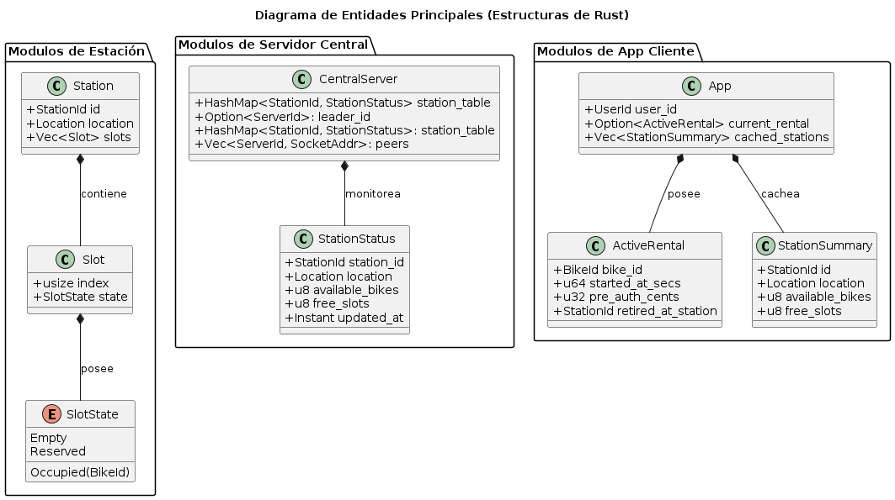
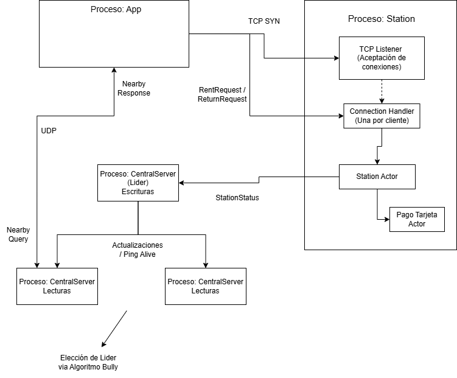
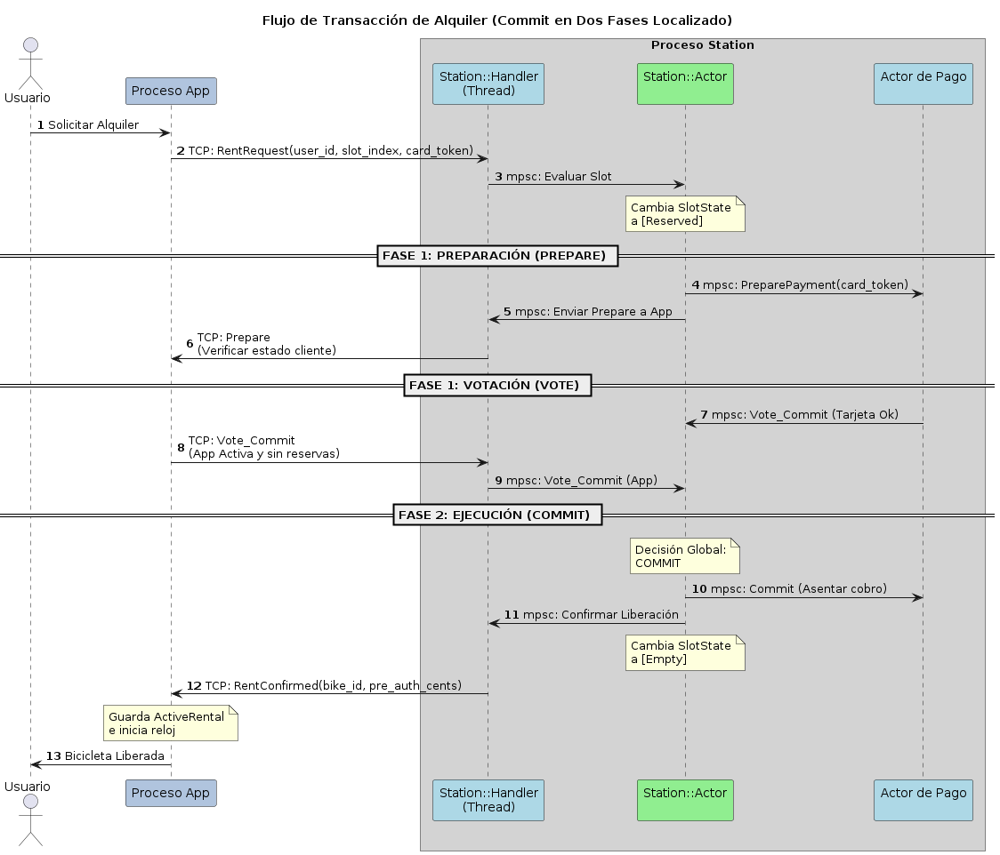

[](https://classroom.github.com/a/KujF6lFv)

# 🚲 BiciRed — Alquiler de Bicicletas

El sistema modela una red de estaciones de bicicletas distribuidas por la ciudad. Cada componente corre como un proceso independiente; y la comunicación entre procesos es a través de sockets.

Dentro de cada proceso se aplica el modelo de actores: cada subsistema es un thread independiente que sólo se comunica a través de canales (usando la librería de Rust mpsc) tipados. Por lo que, no hay memoria compartida entre actores.


---

## Tabla de contenidos

- [Arquitectura de procesos](#arquitectura-de-procesos)
- [Entidades principales](#entidades-principales)
  - [Station](#station)
  - [CentralServer](#centralserver)
  - [App](#app)
- [Flujos principales](#flujos-principales)
- [Manejo de errores y caídas](#manejo-de-errores-y-caídas)
- [Operación offline](#operación-offline)
- [Algoritmos de concurrencia distribuida](#algoritmos-de-concurrencia-distribuida)
  - [Elección de líder — Bully](#elección-de-líder--bully)
  - [Transacciones de alquiler — 2PC](#transacciones-de-alquiler--2pc)
- [Diagramas](#diagramas)

---

## Arquitectura de procesos

```
[APP] ──────────────────► [STATION]
[APP] ──────────────────► [CENTRALSERVER]
[STATION] ──────────────► [CENTRALSERVER]
```

| Proceso         | Rol                                                        |
|-----------------|------------------------------------------------------------|
| `Station`       | Gestiona slots físicos, cobra pagos                        |
| `CentralServer` | Mantiene estado global de todas las estaciones             |
| `App`           | Simula la app móvil del usuario                            |

Se pueden correr múltiples instalaciones de CentralServer simultáneamente. Una actúa como líder (recibe actualizaciones de las Stations y replica el estado a los demás nodos). Las demás réplicas (responden consultas de disponibilidad de las Apps). Si el líder cae, los nodos restantes eligen a uno nuevo mediante el [Algoritmo de Bully](#elección-de-líder--bully).

---

## Entidades principales

### Station

Gestiona los slots físicos de una estación. Detecta bicicletas, las bloquea y desbloquea, cobra tarifas y reporta su estado al servidor central. **Opera de forma autónoma aunque pierda conectividad.**

> **Invariante:** Una estación no debe permitir más de un alquiler simultáneo sobre el mismo `slot_id`.

#### Estado interno

```rust
struct Station {
    id: StationId,
    location: Location,
    slots: Vec<Slot>,
}

struct Slot {
    index: usize,
    state: SlotState,
}

enum SlotState {
    Empty,
    Occupied { bike_id: BikeId },
    Reserved,
}
```

#### Arquitectura interna (threads)

| Thread            | Responsabilidad                                                                 |
|-------------------|---------------------------------------------------------------------------------|
| `Acceptor`        | Escucha nuevas conexiones TCP desde la App; spawnea un `Handler` por conexión   |
| `Handler`         | Traduce mensajes TCP a mensajes `mpsc` entre la App y el Station Actor          |
| `Station Actor`   | Único dueño de `Vec<Slot>`; único que modifica el estado de los slots           |
| `Actor de pago`    | Simula el proceso de pago de forma asíncrona para no bloquear la estación       |

#### Mensajes que recibe

| Mensaje         | Payload                                    | Reacción                                                                                      |
|-----------------|--------------------------------------------|-----------------------------------------------------------------------------------------------|
| `RentRequest`   | `{ user_id, slot_index, card_token }`      | Si slot ocupado → desbloquea bicicleta, responde `RentConfirmed`; si no → `RentRejected`      |
| `ReturnRequest` | `{ user_id, bike_id, slot_index, started_at }` | Si slot vacío → bloquea bicicleta, calcula cargo proporcional al tiempo, responde `ReturnConfirmed`; si no → `ReturnRejected` |

#### Mensajes que envía

| Mensaje          | Destino         | Payload                                              |
|------------------|-----------------|------------------------------------------------------|
| `RentConfirmed`  | App             | `{ bike_id, pre_auth_cents, timestamp_secs }`        |
| `RentRejected`   | App             | `{ reason: String }`                                 |
| `ReturnConfirmed`| App             | `{ charged_cents, timestamp_secs }`                  |
| `ReturnRejected` | App             | `{ reason: String }`                                 |
| `StationStatus`  | CentralServer   | `{ station_id, location, available_bikes, free_slots, timestamp_secs }` |

---

### CentralServer

Mantiene una vista actualizada del estado de todas las estaciones y responde consultas de disponibilidad. Recibe actualizaciones periódicas de las estaciones sin bloquearlas.

```rust
struct CentralServer {
    id: ServerId,
    leader_id: Option<ServerId>,
    station_table: HashMap<StationId, StationStatus>,
    peers: Vec<(ServerId, SocketAddr)>,
}

struct StationStatus {
    station_id: StationId,
    location: Location,
    available_bikes: u8,
    free_slots: u8,
    updated_at: Instant,
}
```

#### Mensajes que recibe

| Mensaje         | Payload                                         | Reacción                                                              |
|-----------------|-------------------------------------------------|-----------------------------------------------------------------------|
| `StationUpdate` | `{ station_id, location, bikes, slots, ts }`    | Actualiza entrada en `station_table` si el timestamp es más reciente  |
| `NearbyQuery`   | `{ location, radius_km }`                       | Filtra tabla por distancia, responde `NearbyResponse`                 |

#### Mensajes que envía

| Mensaje          | Destino | Payload                                                         |
|------------------|---------|-----------------------------------------------------------------|
| `NearbyResponse` | App     | `Vec<StationSummary { id, location, available_bikes, free_slots }>` |

---

### App

Simula la app móvil del usuario. Se conecta directamente a la estación para alquilar/devolver y al servidor central para consultar disponibilidad. Mantiene caché local para operación offline.

```rust
struct App {
    user_id: UserId,
    current_rental: Option<ActiveRental>,
    cached_stations: Vec<StationSummary>,
}

struct ActiveRental {
    bike_id: BikeId,
    started_at_secs: u64,
    pre_auth_cents: u32,
    retired_at_station: StationId,
}
```

#### Mensajes que recibe

| Mensaje          | Origen        | Payload                                                         |
|------------------|---------------|-----------------------------------------------------------------|
| `RentConfirmed`  | Station       | `{ bike_id, pre_auth_cents, timestamp_secs }`                   |
| `RentRejected`   | Station       | `{ reason: String }`                                            |
| `ReturnConfirmed`| Station       | `{ charged_cents, timestamp_secs }`                             |
| `ReturnRejected` | Station       | `{ reason: String }`                                            |
| `NearbyResponse` | CentralServer | `Vec<StationSummary { id, location, available_bikes, free_slots }>` |

#### Mensajes que envía

| Mensaje         | Destino       | Payload                                          |
|-----------------|---------------|--------------------------------------------------|
| `NearbyQuery`   | CentralServer | `{ location, radius_km }`                        |
| `RentRequest`   | Station       | `{ user_id, slot_index, card_token }`            |
| `ReturnRequest` | Station       | `{ user_id, bike_id, slot_index, started_at }`   |

---

## Flujos principales

### Flujo 1 — Alquiler (caso feliz)

```
App  ──RentRequest──►  Station
App  ◄──RentConfirmed──  Station
                         Station  ──StationStatus──►  CentralServer
```

### Flujo 2 — Devolución (caso feliz)

```
App  ──ReturnRequest──►  Station
App  ◄──ReturnConfirmed──  Station
                           Station  ──StationStatus──►  CentralServer
```

### Flujo 3 — Consulta de estaciones cercanas

```
App  ──NearbyQuery──►  CentralServer
App  ◄──NearbyResponse──  CentralServer
```

---

## Manejo de errores y caídas

| Escenario                  | Comportamiento                                                                                       |
|----------------------------|------------------------------------------------------------------------------------------------------|
| **Crash de la App**        | La estación tiene timeout en el socket; si la App no confirma el retiro, el slot se libera automáticamente luego de `x` segundos (configurable) |
| **Caída del CentralServer**| Las estaciones siguen funcionando. Los usuarios no pueden buscar nuevas estaciones pero pueden interactuar con las que ya conocen |
| **Fallo en pago**          | La transacción se marca como `pending` para ser reintentada más adelante                             |
| **Muerte de Proceso Station** | La información actual se guardará en disco para mantener el último estado antes de la caída, para una posterior recuperación

---

## Operación offline

### App sin señal — consulta de disponibilidad

Usa `cached_stations` (última `NearbyResponse` recibida).

### Pérdida de conexión con CentralServer (App o Station)

- **Alquiler**: se permite si la App ya tiene la IP de la estación en caché. La estación guarda el evento localmente y actualiza su estado.
- **Sincronización**: cuando la conexión se recupera, la estación envía un `BatchUpdate` al servidor para regularizar los estados.

---

## Algoritmos de concurrencia distribuida

### Elección de líder — Bully

Para evitar que `CentralServer` sea un único punto de falla, se mantiene una cantidad de réplicas constantes del servidor ejecutándose de forma independiente.

**Roles:**

```
Station_1  ──StationUpdate──►  CentralServer_líder
Station_2  ──StationUpdate──►  CentralServer_líder
                               CentralServer_líder  ──replica──►  CentralServer_2
                               CentralServer_líder  ──replica──►  CentralServer_3

App_1  ──NearbyQuery──►  CentralServer_2  (réplica)
App_2  ──NearbyQuery──►  CentralServer_3  (réplica)
```

La detección de la caída del líder se dará mediante la utilización de un mensaje con un byte de contenido, que busca validar que este se encuentra en buen estado. Ante la llegada de un timeout en uno de los procesos réplica que no reciba el mensaje en cierto tiempo (un intervalo en el que varios mensajes de aviso sean mandados, para evitar elección ante la presencia de latencia),  se comenzará con la fase de elección de un nuevo líder mediante el algoritmo de Bully


---

### Transacciones de alquiler — 2PC

Para garantizar el flujo en el alquiler de las bicicleta, evitando inconsistencias locales y distribuidas, en el que se alquile dos veces la misma bicicleta, se alquile una bicicleta sin pagar o un usuario alquile dos bicicletas al mismo tiempo, se recurrirá al uso de transacciones.
El algoritmo de commit en dos fases permitirá que una bicicleta se libere sólamente si el pago fue autorizado


| Rol           | Participante               |
|---------------|----------------------------|
| Coordinador   | `Station Actor`            |
| Participante 1| App del usuario            |
| Participante 2| Hilo de pago               |

**Fase 1 — Prepare:** la estación envía `Prepare` a ambos participantes:
- Al **actor de pago**: verifica fondos y pre-autoriza el token de tarjeta.
- A la **App**: verifica que sigue activa y sin reserva en curso.

**Fase 2 — Commit / Abort:**

| Condición                                    | Resultado              |
|----------------------------------------------|------------------------|
| Pago aprobado + App responde `Vote_Commit`    | `Commit` → reserva guardada |
| Pago rechazado                               | `Abort`                |
| App no responde (caída)                      | `Abort`                |
| App tiene reserva activa                     | `Abort`                |

**Post-commit:**
- Si está **online**: envía `StationStatus` inmediatamente al líder del `CentralServer`.
- Si está **offline**: retiene el evento y lo incluye en el `BatchUpdate` al recuperar conectividad.

---

## Diagramas

### Diagrama de clases



### Diagrama de threads



### Diagrama de flujo alquiler



